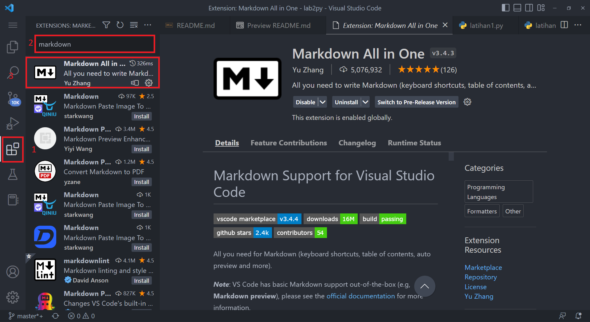

___
# Langkah Langkah Belajar Python

Nama    :   Garnish Andhika Prtama
Nim     :   312210161
Kelas   :   T1.22.B1
MK      :   Bahasa Pemrograma
**Daftar ISI :**
 > - [Pengertian Python](#apa-itu-python)
 > - [Tool yang dibutuhkan](#tool-yang-dibutuhkan)
 > - [Latihan 1](#latihan-1)
 > - [Latihan 2](#latihan-2)
 > - [Latihan 3](#latihan-3)
## Apa itu Python ?
Python adalah bahasa pemrograman yang populer. Itu dibuat oleh Guido van Rossum, dan dirilis pada tahun 1991.

Ini digunakan untuk:

- pengembangan web (sisi server),
- pengembangan perangkat lunak,
- matematika,
- skrip sistem.

### Tool yang dibutuhkan
1. Python silahkan download disini lalu install [python](https://www.python.org/downloads/)
2. Cara instalasi python [cara install](https://www.petanikode.com/python-windows/)

3. Text Editor disini kita memakai Visual Studio Code download dan install terlebih dahulu [visual studio code](https://code.visualstudio.com/download/)

4. Cara instalasi Visual studio code [cara install vsc](https://www.rsetiawan.com/2022/08/cara-install-visual-studio-code.html/)

5. Buka visual studio code lalu Install extension python


6. Lalu install extension Markdown preview dengan cara berikut




### `Latihan 1`
1. Buat file bernama Latihan1.py
2. Lalu masukan kode berikut

```python
# print() method untuk menampilkan output
# kita akan menampilkan beberapa output berupa string
print("Haloo dunia")
print("Saya sedang belajar Pyton")
```
3. Setelah itu jalankan file tersebut
Berikut hasil output yang ditampilkan


### `Latihan 2`
1. Buat file bernama Latihan2.py
2. Lalu masukan kode berikut

```python
# membuat variable a & b untuk menyimpan nilai
a = 6
b = 8

# menjumlahkan variable a + b dan disimpan didalam variable c
c = a + b

# menampilkan output variable a & c
print("Ini adalah variable a = ", a)
print("Ini adalah variable b = ", b)

# menampilkan output variable c hasil dari penjumlahan a + b
print("hasil penjumlahan a + b = ", c)

```
3. Setelah itu jalankan file tersebut
Berikut hasil output yang ditampilkan


### `Latihan 3`
1. Buat file bernama Latihan3.py
2. Lalu masukan kode berikut

```python
# mengimport module math
import math

# masukan atau input nilai variable a dan b
a = input("Masukan nilai a : ")
b = input("Masukan nilai b : ")

# menampilkan isi variable a dan b yang sudah diinput sebelumnya.
print("variable a = ", a)
print("variable b = ", b)


"""
Metode format() memformat nilai yang ditentukan dan memasukkannya ke dalam placeholder string.
Placeholder didefinisikan menggunakan tanda kurung kurawal: {}.
Metode format() mengembalikan string yang diformat.
 {0} akan diisi oleh variable a
 {1} akan diisi oleh variable b
"""
print("Hasil penggabungan {0} & {1} = " .format(a, b) + (a + b))

# mengkonversi nilai variable ke integer dengan method int()
a = int(a)
b = int(b)

# pow() method untuk mempangkatkan nilai. variable a pangkat b
pangkat = pow(a, b)

# menampilkan hasil penjumlahan dari a + b
print("Hasil Penjumlahan {0} + {1} = %d".format(a, b) % (a + b))

# menampilkan hasil pembagian dari a / b
print("Hasil Pembagian {0} / {1} = %d".format(a, b) % (a / b))

# menampilkan hasil perkalian dari a * b
print("Hasil Perkalian {0} * {1} = %d".format(a, b) % (a * b))

# menampilkan hasil perpangkatan dari a ^ b
print("Hasil Perpangkatan {0}^{1} = %d".format(a, b) % pow(a, b))

"""Metode math.sqrt() => mengembalikan akar kuadrat dari suatu angka:
kita akan menampilkan hasil akar kuadrat dari variable pangkat diatas
"""
print("Hasil akar {0} = %d".format(pangkat) % math.sqrt(pangkat))


```
3. Setelah itu jalankan file dengan mengetikan diconsole terminal visual studi code  `python latihan3.py`
Berikut hasil output yang ditampilkan


